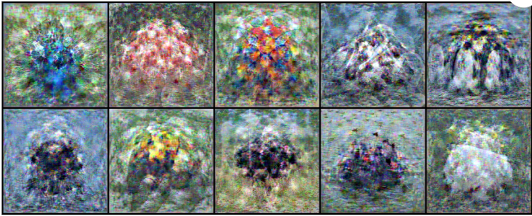
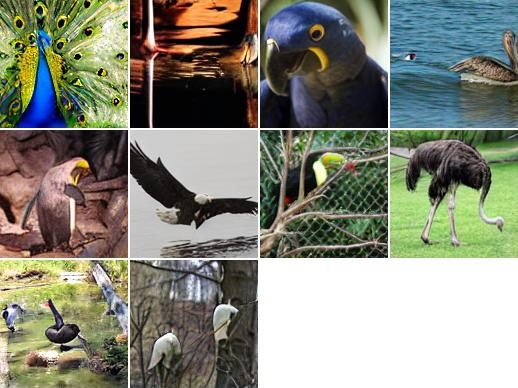
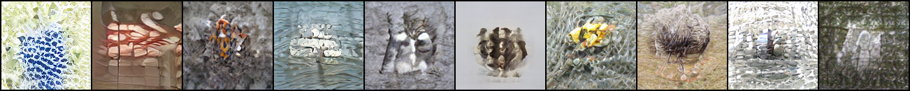

# Diffusion-distillation
SOTA_distilled:  
  
Ours_initilized:  
  
Ours_distilled:  
  

This project utilizes Stable Diffusion to do data distillation. The core idea is to optimize token embeddings to guide the generation of distilled images. To enhance the distillation result, token embeddings are initialized using the method in paper ["Training on Thin Air: Improve Image Classification with Generated Data"](https://arxiv.org/pdf/2305.15316.pdf). The distillation method used in the project is Gradient matching. For the details of distillation method and pipeline, please refer to paper ["Generalizing Dataset Distillation via Deep Generative Prior"](https://arxiv.org/pdf/2305.01649.pdf).  

## Data and Model preparation
For the data to distill, this project uses a 10-classes subset of Imagenet. Before running the codes, the imagenet dataset should be downloaded and stored to a folder named "imagenet". Within the folder, training dataset and evaluation dataset should be separated and stored to two folders named "imagenet_train" and "imagenet_val", respectively.  

To prepare the stable diffusion model, checkpoints should be downloaded. Following the file structure on HuggingFace, the user needs to download ["CompVis/stable-diffusion-v1-4"](https://huggingface.co/CompVis/stable-diffusion-v1-4/tree/main).  

## Running codes
To get started, first create an enviroment:
```
conda env create -f environment.yaml
conda activate di
pip install -r requirements.txt
```
After creating the environment, token embeddings needs to be initialized:
```
accelerate launch src/inversion.py --pretrained_model_name_or_path=CompVis/stable-diffusion-v1-4 --output_dir=/home/dltp_haonan/zyt/diffusion_inversion/logs/imagenet --dataset_name=imagenet --data_dir=imagenet --gradient_accumulation_steps=1 --resolution=128 --train_batch_size=50 --num_tokens=5 --num_emb=10 --max_train_steps=8000 --lr_warmup_steps=0 --interpolation=bicubic --lr_scheduler=constant --learning_rate=3e-02 --checkpointing_steps=1000 --save_steps=1000 --save_image_steps=400 --resume_from_checkpoint=latest --group_id=0
```
Then we can start to distill our data
```
accelerate launch src/diffuser_inversion.py --pretrained_model_name_or_path=CompVis/stable-diffusion-v1-4 --dataset_name=imagenet-birds --data_dir=imagenet --ipc=1 --train_batch_size=256 --resolution=128 --outer_loop=2 --save_it=5 --eval_it=10 --num_train_steps=100 --learning_rate=3e-2
```
